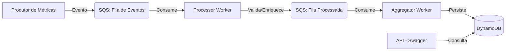

# Developer Metrics Pipeline


Pipeline de dados orientado a eventos (EDA) desenvolvido em **.NET 9** para coleta, processamento e agregação de métricas de produtividade de desenvolvedores em tempo real.

## 📋 Pré-requisitos
Para executar este projeto, você precisará dos seguintes softwares instalados em sua máquina:

* **[Docker Desktop](https://www.docker.com/products/docker-desktop/):** Necessário para rodar os containers e o orquestrador Docker Compose.
* **.NET 9 SDK:** Caso deseje compilar ou realizar alterações no código dos serviços.
* **Git:** Para clonar o repositório.

*Certifique-se de que o Docker esteja em execução antes de iniciar o projeto.*

## 🛠️ Stack Tecnológica
* **Linguagem:** C# (.NET 9)
* **Padrão:** BackgroundServices (Worker SDK)
* **Orquestração:** Docker & Docker Compose
* **Mensageria:** Amazon SQS
* **Persistência:** Amazon DynamoDB
* **Ambiente Local:** **LocalStack** (Emulação completa e isolada dos serviços AWS, garantindo consistência total do ambiente de desenvolvimento).
  
## 🏗️ Arquitetura do Sistema
O sistema foi projetado seguindo princípios de **Event-Driven Architecture (EDA)**, focando em escalabilidade e resiliência:

* **Desacoplamento:** A comunicação é feita exclusivamente via mensageria (Amazon SQS), garantindo que os serviços de processamento e agregação operem de forma assíncrona e independente.
* **Infraestrutura como Código (IaC):** Através do **LocalStack**, todo o ecossistema AWS (SQS e DynamoDB) é provisionado automaticamente. Isso elimina qualquer configuração manual, garantindo um ambiente de desenvolvimento idêntico ao de produção.
* **Resiliência e Consistência:** O fluxo de dados foi desenhado para suportar falhas transientes, utilizando o padrão de entrega *At-Least-Once*, onde o ciclo de vida da mensagem é controlado para assegurar que nenhum evento de métrica seja perdido.

## 🛡️ Padrões de Arquitetura
O projeto foi estruturado seguindo princípios de **Clean Architecture** e **SOLID**, garantindo um código de alta manutenibilidade:

* **Desacoplamento de Infraestrutura:** A lógica de negócio é agnóstica em relação aos serviços de mensageria. Utilizamos interfaces para isolar o SDK da AWS, permitindo a fácil substituição de provedores de mensageria ou banco de dados.
* **Separation of Concerns (SoC):** Cada *Worker* possui responsabilidade única (*Single Responsibility Principle*). O `Processor` preocupa-se estritamente com validação e enriquecimento, enquanto o `Aggregator` foca exclusivamente na consolidação e persistência dos dados.
* **Testabilidade:** A separação entre o domínio (contratos de métricas) e a infraestrutura facilita a criação de testes unitários para a regra de negócio.

## 📐 Fluxo de Arquitetura

O desenho abaixo ilustra a jornada da métrica desde a entrada do dado até a consulta na API:


  
---

## 🚀 Como Executar o Projeto

Para rodar o ecossistema completo, basta realizar o clone do repositório e executar o comando de orquestração. O ambiente configurado cuidará automaticamente da criação da infraestrutura, provisionamento dos recursos AWS e injeção da carga de mensagens de teste.

### 1. Clonar o Repositório
```bash
git clone https://github.com/JTBCode86/developer-metrics-pipeline.git
```
### 2. Abra o seu terminal, navegue até a pasta developer-metrics-pipeline e execute o comando abaixo
```bash
cd developer-metrics-pipeline
```
### 3. Executar o comando abaixo
```bash
docker-compose up --build
```
**O que este comando faz:**

* **Infraestrutura:** Subida do ambiente LocalStack.
* **Provisionamento:** Criação automática das filas SQS e tabelas DynamoDB.
* **Carga Inicial:** Disparo do *seed* de eventos conforme requisitos do projeto.
* **Execução:** Inicialização de todos os serviços (Workers) prontos para processar os dados.

## 📝 Documentação da API (Swagger/OpenAPI)

Este projeto utiliza o **Swagger (OpenAPI)** para documentação de contrato. Esta escolha estratégica garante que a documentação reflita exatamente o estado atual do código, eliminando discrepâncias entre o que está implementado e o que está disponível.

### Por que esta abordagem?
* **Sincronização:** O contrato de dados (schemas) é exposto automaticamente, permitindo que consumidores da API entendam os tipos de dados e obrigatoriedades antes mesmo de realizarem a integração.
* **Autonomia:** Desenvolvedores podem explorar e validar comportamentos da API diretamente pela interface interativa, reduzindo drasticamente o tempo de *debug* e testes de integração.

### Como utilizar em desenvolvimento
Após subir o ambiente via Docker (`docker-compose up`), a documentação interativa estará disponível para exploração e testes:

1. **Acesso:** Acesse `http://localhost:5000/swagger` no seu navegador.
2. **Exploração:** Visualize todos os verbos HTTP disponíveis e os modelos de dados (schemas).
3. **Teste em tempo real:**
    * Clique no endpoint desejado (ex: `/metrics/{developer_id}/summary`).
    * Clique no botão **"Try it out"**.
    * Informe o parâmetro necessário (ex: `developer_id`) e clique em **"Execute"** para ver a resposta formatada em JSON.

**Endpoints Principais:**
* `GET /health`: Monitoramento de prontidão (*Health Check*).
* `GET /metrics/{developer_id}`: Recuperação de eventos brutos processados.
* `GET /metrics/{developer_id}/summary`: Consulta consolidada com métricas agregadas e cálculo de média sob demanda.

 *Dica:* A documentação interativa é gerada dinamicamente, garantindo que o contrato de integração esteja sempre atualizado com a implementação do código.*

## 📊 Observabilidade e Monitoramento
A observabilidade é unificada no terminal do Docker, permitindo o acompanhamento em tempo real:

* **Processor:** Log detalhado de validação de contratos e enriquecimento de eventos (UUID v4).
* **Aggregator:** Processamento assíncrono e exibição de métricas persistidas.
* **API de Consulta:** Interface REST (via Swagger) para consulta em tempo real das métricas agregadas por desenvolvedor, com cálculos de performance realizados no momento da leitura.

## 🛡️ Engenharia e Boas Práticas
* **Resiliência:** Processamento *At-Least-Once*.
* **Concorrência:** Gerenciamento seguro de estado via coleções concorrentes.
* **Escalabilidade:** Estrutura pronta para produção com *Single-Table Design* no DynamoDB.

## 🔧 Troubleshooting
Caso encontre problemas persistentes durante a orquestração ou alterações nos scripts não sejam aplicadas pelo Docker, você pode limpar o cache de build para forçar uma nova reconstrução das imagens:

```bash
docker system prune -a --volumes
docker builder prune -f
docker-compose up --build
```

Consultar Logs
```bash
docker logs -f metrics-processor
docker logs -f metrics-aggregator
```
Consultar direto no DynamoDb
```bash
aws dynamodb list-tables --endpoint-url http://localhost:4566 --region us-east-1
aws dynamodb scan --table-name events --endpoint-url http://localhost:4566 --region us-east-1
aws dynamodb scan --table-name developer_summary --endpoint-url http://localhost:4566 --region us-east-1
```

## 🤝 Contribuições
Contribuições são bem-vindas! Sinta-se à vontade para abrir uma *Issue* ou enviar um *Pull Request* caso encontre melhorias, correções de bugs ou novas funcionalidades para o pipeline.

---
*Desenvolvido com foco em arquitetura de sistemas distribuídos e boas práticas de desenvolvimento .NET*
